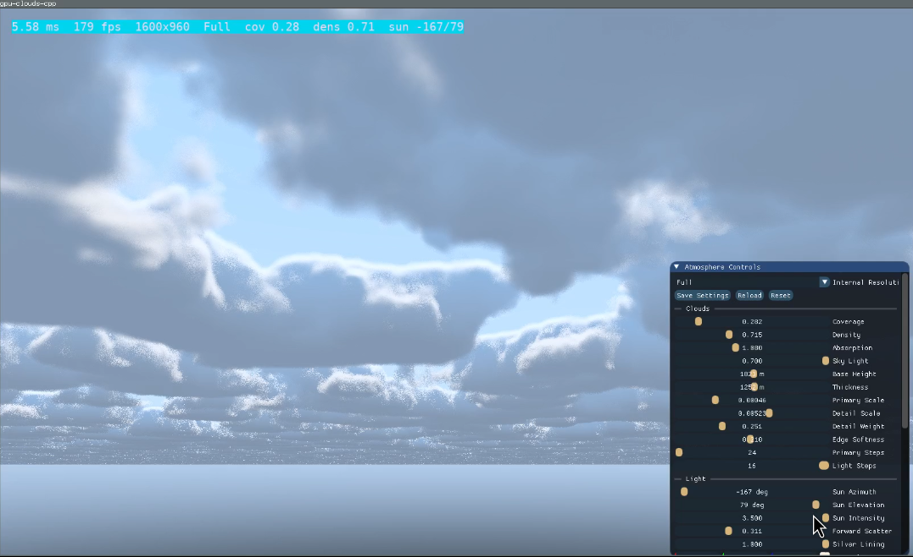

# gpu-clouds-cpp

Standalone Vulkan volumetric cloud demo.



## Status

This repo is the finished endpoint for the demo:

- Vulkan compute cloud renderer
- Real-time cloud lighting
- SDL3 floating window workflow
- SDL3_ttf performance overlay
- Dear ImGui controls and JSON preset save/load
- Bloom pass that helps the cloud shapes read more strongly

It is in a good stopping place as a visual demo and renderer experiment.

## Features

- Vulkan compute cloud renderer
- Real-time single-scatter cloud lighting
- SDL3 windowing and input
- SDL3_ttf HUD overlay
- Dear ImGui controls for resolution, cloud shape, wind, and lighting
- JSON preset load/save via `cloud-settings.json`
- Lightweight bloom and god-ray post controls

## Rendering Notes

- Cloud motion is a mix of wind advection and slow noise evolution.
- The bloom pass is part of the intended final look.
- The current god-ray control is a stylized screen-space effect, not a true world-space volumetric shaft solution.
- A more correct future approach would be a sun-space cloud transmittance/shadow map plus a lower-atmosphere fog march.

## Build

```bash
cmake --preset debug
cmake --build --preset debug
./build/debug/gpu-clouds-cpp
```

## VS Code

Open the `gpu-clouds-cpp` folder and press `F5`.

That runs the `build` task, then launches `build/debug/gpu-clouds-cpp` under `gdb`.

## Controls

- `Right Mouse`: capture mouse and look around
- `W A S D`: move
- `Space` / `Shift`: move up / down
- ImGui panel: resolution, cloud, light, wind, post, and preset settings
